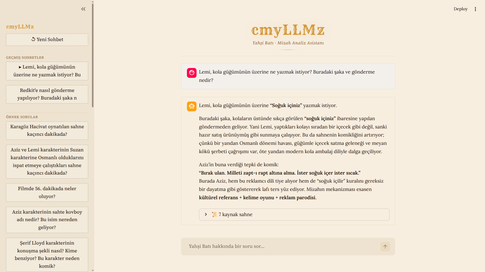

# cmyLLMz — Yahşi Batı Mizah Analiz Asistanı

> Cem Yılmaz'ın **Yahşi Batı (2010)** filminin mizahını analiz eden, açıklayan ve sorgulatan **RAG tabanlı yapay zeka sistemi.**

[](https://www.python.org/)
[](https://streamlit.io/)
[](https://www.trychroma.com/)
[](https://openai.com/)
[](https://huggingface.co/BAAI/bge-m3)

<p align="center">
  
</p>

---

## İçindekiler

- [Proje Hakkında](#proje-hakkında)
- [Sistemin Yapabilecekleri](#sistemin-yapabilecekleri)
- [Mimari ve Çalışma Mantığı](#mimari-ve-çalışma-mantığı)
- [Veri Seti: Özgün Katkı](#veri-seti-özgün-katkı)
- [Veri Şeması](#veri-şeması)
- [Teknoloji Stack'i](#teknoloji-stacki)
- [Başarı Metrikleri](#başarı-metrikleri)
- [Kurulum](#kurulum)
- [Kullanım](#kullanım)
- [Proje Yapısı](#proje-yapısı)
- [Edinilen Dersler](#edinilen-dersler)
- [Bilinen Sınırlamalar ve Post-MVP Liste](#bilinen-sınırlamalar-ve-post-mvp-liste)

---

## Proje Hakkında

**cmyLLMz**, Yahşi Batı filminin altyazı ve sahne verisini kullanarak filmin mizahını derinlemesine inceleyebilen bir asistan. Kullanıcı doğal dilde bir soru sorduğunda (örneğin _"Garfield şakası neden komik?"_), sistem filmden ilgili sahneleri vektör tabanlı arama ile bulur ve LLM yardımıyla detaylı bir mizah analizi üretir.

Proje iki dersin gerekliliklerini tek bir çalışmayla karşılayacak şekilde tasarlandı:

- **MBU (Mühendislikte Bilgisayar Uygulamaları II - Dr. Halil İbrahim Okur):** RAG pipeline, LLM entegrasyonu, Streamlit arayüzü
- **NLP (Doğal Dil İşleme - Dr. Kadir Tohma):** Tokenizasyon, embedding, retrieval kalitesi ölçümü, evaluation metodolojisi

Projenin asıl özgün değeri sadece "RAG kurmak" değil, **3 hafta boyunca üç ayrı izlemede elle hazırlanmış ve zenginleştirilmiş 62 sahne chunk'lık bir mizah veri seti** üretmiş olmasıdır.

---

## Sistemin Yapabilecekleri

| # | Yetenek | Örnek Sorgu |
|---|---------|-------------|
| 1 | Bir şakayı açıklamak | _"Garfield şakası neden komik?"_ → Ramazan ABD başkanı Garfield'ı karikatür kediyle karıştırır |
| 2 | Bir şakanın devamını getirmek | _"Karagözüm yapma, mübarek Ramazandayız."_ → _"Hiç tasa etme Hacı cavcav, sülalece arkandayız!"_ |
| 3 | Spesifik detayı bulmak | _"Cem Yılmaz'ın bir filminde karakter Mickey Mouse oynatıyordu, hangi filmdi, replik neydi?"_ |
| 4 | Karakter analizi | _"Lemi Galip ne tür mizah kullanıyor, saflık mı ironi mi?"_ |
| 5 | İçerik kaynağını bulmak | _"'Aziz Efendi, at nalı ne işe yarar?' repliği hangi filmde kime ait?"_ |
| 6 | Mizah tekniğine göre sahne listesi | _"Filmde anakronizm kullanılan sahneler neler?"_ |
| 7 | Karakter karşılaştırma | _"Aziz ve Lemi nasıl farklı güldürüyor?"_ |
| 8 | Benzer şakayı bulmak | _"Garfield gibi başka yanlış anlama şakası var mı filmde?"_ |
| 9 | Kültürel referans açıklama | _"Teşkilât-ı Mahsusa nedir, filmde neden geçiyor?"_ |
| 10 | Tekrar eden espriyi takip | _"Zıbık konusu filmde kaç kez ve hangi bağlamlarda geri geliyor?"_ |
| 11 | Setup/punchline ayrıştırma | _"Garfield şakasında setup nerede başlıyor, punchline nerede patlıyor?"_ |
| 12 | Timestamp tabanlı sorgu | _"Filmin 47. dakikasında kim ne diyordu?"_ |

---

## Mimari ve Çalışma Mantığı

### Pipeline Akışı

```
Kullanıcı sorusu
       │
       ▼
Soru → Embedding (BAAI/bge-m3, 1024 boyut)
       │
       ▼
ChromaDB cosine similarity → top-k=5 chunk
       │
       ▼
related_chunks expansion (setup/punchline kopukluğunu önler — maks 8 chunk)
       │
       ▼
[chunk metinleri + timestamp + soru + system prompt] → OpenAI gpt-5.4-mini
       │
       ▼
Streaming cevap + kaynak sahneler kullanıcıya gösterilir
```

### Çok Çözünürlüklü Retrieval (Mimari)

Sistem iki ayrı çözünürlük üzerine kurgulandı; uygulamada **chunk seviyesi yeterli** olduğundan block seviyesi post-MVP olarak işaretlendi.

| Katman | Granülerlik | Use Case | Collection |
|--------|-------------|----------|------------|
| **Chunk** ✅ | 62 sahne, ortalama 100s | Semantik sorular | `yb_chunks` |
| **Block** ⏸ | 1644 altyazı birimi, ~3-5s | Spesifik replik / timestamp | `yb_blocks` (post-MVP) |

### LLM'e İletilen Sistem Prompt'unun Özü

- Bu chunk'lar bir filmin sahneleri, ID'ler (`yb_001`, `yb_002`...) **kronolojik sırayı** yansıtır
- Bağlamda olmayan bilgi uydurma; _"bu bilgi veri setimde yok"_ de
- Mizah mekanizmasını açıkla, kültürel bağlamı ver, birden fazla sahneyi sentezle
- Türkçe ve samimi dil kullan

---

## Veri Seti: Özgün Katkı

Bu projenin ayırt edici tarafı, filmden **elle hazırlanmış, üç izleme geçirmiş, zenginleştirilmiş chunk veri setidir**. Toplam emek: ~3 hafta.

### Veri Hazırlama Pipeline'ı (13 Faz)

```
Faz 1  ✅  SRT → Ham Block'lar (srt_parser.py) — 1653 altyazı birimi
Faz 2  ✅  block_referans.md üretildi — NNNN [HH:MM:SS] formatında insan-okunabilir kaynak
Faz 3  ✅  1. İzleme — Karakter kodları (-AZ-, -LE-, -ZE-...) + chunk sınırları (===)
Faz 4  ✅  2. İzleme — Detaylı içerik notları [köşeli parantez içinde inline]
              kültürel referanslar, görsel gag, wordplay mekanizmaları, anakronizmler
Faz 5  ✅  Türkçe diakritik normalizasyonu (GPT-4o-mini, ~$0.01) — 1107 segment
Faz 6  ✅  3. İzleme — @lokasyon directive'leri + (bkz. yb_NNN) cross-reference'leri
Faz 7  ✅  chunk_merger.py: location parsing, related_chunks extract, base_chunks.json
Faz 8  ✅  enricher.py: techniques, mechanism, cultural_context, summary
Faz 9  ⛔  NER atlandı (entities boş — RAG için zorunlu değil)
Faz 10 ✅  Embedding (BAAI/bge-m3) + ChromaDB indeksleme
Faz 11 ✅  Retriever + LLM entegrasyonu, related_chunks expansion
Faz 12 ✅  Streamlit chat arayüzü (streaming, sohbet geçmişi, kaynak gösterimi)
Faz 13 ✅  Evaluation — retrieval testi + LLM-as-a-Judge quality testi
```

### Veri İstatistikleri

| Metrik | Değer |
|--------|-------|
| Toplam altyazı bloğu | 1644 (1653 ham, 9 kasıtlı silinmiş) |
| Toplam chunk (sahne) | 62 |
| Ortalama chunk süresi | 100s |
| Min / max chunk süresi | 35s / 286s |
| Toplam karakter sayısı | 55 |
| Inline not sayısı | 1107 (Türkçe normalize edildi) |
| Cross-reference sayısı | 56 (`bkz.` referansları) |
| Lokasyon directive | 62 (her chunk için bir tane) |

---

## Veri Şeması

### `block_referans.md` — Ana Veri Kaynağı

Tüm manuel iş JSON'da değil, insan-okunabilir markdown'da yapıldı. Bu sayede JSON yeniden üretilse bile manuel düzenlemeler kaybolmadı.

```
===001===
@lokasyon beykoz meyhanesi
0001 [00:00:14] [yahşi batı filmi başlıyor. dört karakter meyhanede bir rakı masasında.
                 samimi bir ortam. arkada kısık sesle "kimseye etmem şikayet" şarkısı
                 çalıyor. AL karakteri erotik shop işleten bir adamın başına gelmiş
                 komik bir hikayeyi anlatıyor:] -AL- Şimdi kadın "ince uzun da olur..."
0002 [00:00:18] şöyle de olur, böyle de olur" deyince...
0003 [00:00:20] bizim usta dayanamıyor, birden ayağa kalkıyor.
```

**Element Açıklamaları**

| Element | Açıklama |
|---------|----------|
| `===NNN===` | Chunk sınırı, sıralı numaralı |
| `@lokasyon X` | Chunk'ın geçtiği mekan |
| `NNNN` | Block sıra numarası (4 digit, sıfır-padded) |
| `[HH:MM:SS]` | Block timestamp |
| `[...]` | Inline sahne notu (görsel detay, kültürel context, mizah açıklaması) |
| `-XX-` | Karakter kodu (text içinde kalır) |
| `(bkz. yb_NNN)` | Başka bir chunk'a cross-reference |

### Chunk Şeması (`base_chunks.json`)

```json
{
  "id": "yb_001",
  "start": "00:00:14",
  "end": "00:00:49",
  "duration_sec": 35.0,
  "block_range": "0001-0012",
  "text": "[yahşi batı filmi başlıyor...] -AL- Şimdi kadın... -RA- Ustaya bak!",
  "characters": {"AL": "Alpay (...)", "RA": "Ramazan (...)", "ZE": "Zeki (...)"},
  "location": "beykoz meyhanesi",
  "related_chunks": ["yb_005", "yb_012"],
  "humor_analysis": {
    "techniques": ["anecdote", "wordplay"],
    "mechanism": "Mizahın nasıl işlediği — kısa, analitik.",
    "cultural_context": "..."
  },
  "summary": "Sahnenin 1-2 cümlelik kısa özeti."
}
```

### Field Sorumluluk Matrisi

| Alan | Kim doldurdu? |
|------|---------------|
| `id`, `start`, `end`, `duration_sec`, `block_range` | Otomatik (chunk_merger.py) |
| `text` (raw, with `-XX-` ve `[...]`) | **Manuel — 3 izleme** |
| `characters` | Otomatik (`-XX-` extract + `karakterler.txt` mapping) |
| `location` | Otomatik (`@lokasyon` directive parse) |
| `related_chunks` | Otomatik (`(bkz. yb_NNN)` regex extract) |
| `humor_analysis` | LLM (OpenAI gpt-4o-mini, enricher.py) |
| `summary` | LLM (OpenAI gpt-4o-mini, enricher.py) |

---

## Teknoloji Stack'i

| Bileşen | Teknoloji | Notlar |
|---------|-----------|--------|
| Embedding | `BAAI/bge-m3` | 1024 boyut, 8192 token, çok dilli (Türkçe dahil) |
| Vektör DB | ChromaDB | `yb_chunks` collection, cosine similarity |
| RAG runtime LLM | OpenAI gpt-5.4-mini | Cevap üretimi (streaming) |
| Evaluation hakem LLM | OpenAI gpt-5.4 | LLM-as-a-Judge, ana modelden farklı boyut |
| Veri zenginleştirme LLM | OpenAI gpt-4o-mini | Tek seferlik veri hazırlama |
| NLP | NLTK / spaCy | Ön işleme |
| Arayüz | Streamlit | Streaming destekli chat, sohbet geçmişi |

### Embedding İçin Birleştirilen Metin

```
{summary} {text} Mekan: {location} Karakterler: {isimler}
Mizah teknikleri: {techniques} Kültürel bağlam: {cultural_context}
```

Bu birleşim sayesinde _"Betty nasıl bir karakter?"_, _"wordplay sahneleri"_, _"meyhanede geçen sahneler"_ gibi farklı kategorideki sorgular yüksek isabetle eşleşiyor. bge-m3'ün 8192 token kapasitesi en uzun chunk'ı bile kesintisiz sığdırıyor.

---

## Başarı Metrikleri

Faz 13'te 20 soruluk test seti üzerinde iki ana ölçüm yapıldı: **retrieval kalitesi** ve **cevap kalitesi (LLM-as-a-Judge)**. Soru tipleri: timestamp (3), character (4), humor (6), cultural (7).

### 1. Retrieval Testi (top-k = 5)

| Metrik | Değer | Yorum |
|--------|-------|-------|
| **Hit Rate** _(ana metrik)_ | **%100** | 20 sorudan hepsi için ≥1 relevant chunk top-k içinde geldi |
| Recall@k | %76.4 | Çoklu chunk'lı sorularda 5 slot tüm relevant'leri sığdıramayabiliyor |
| Precision@k | %17.3 | Bilgilendirici; related_chunks expansion nedeniyle payda 5'ten büyük olabiliyor |

Tüm soru tiplerinde Hit Rate **%100**.

### 2. Quality Testi — LLM-as-a-Judge

Hakem: OpenAI **gpt-5.4** (RAG runtime modeli gpt-5.4-mini'den farklı boyut → kısmi yanlılık riski azaltıldı). Her soru için 3 çağrı: RAG cevabı, No-RAG cevabı, hakem puanlaması. Toplam 60 çağrı, ~$0.40.

| Kriter | RAG | No-RAG | Fark |
|--------|-----|--------|------|
| **Doğruluk** | **4.65/5** | 1.45/5 | **+3.20** |
| Detay | 4.65/5 | 2.05/5 | +2.60 |
| Tutarlılık | 4.70/5 | 3.70/5 | +1.00 |

**Yorum:**

- **Doğruluk farkı +3.20** → No-RAG base model film hakkında spesifik bilgiye sahip değil; "20-30. dakika civarı diye hatırlıyorum" gibi tahminlerle cevap veriyor. **No-RAG'in 1.45 doğruluk skoru hallucination metriğinin yerini tutuyor.**
- **Detay farkı +2.60** → System prompt'a eklenen _"mizah mekanizmasını açıkla"_ talimatı RAG cevaplarını zenginleştiriyor.
- **Tutarlılık farkı küçük (+1.00)** → İki cevap da aynı modelden; ayrım içerikten geliyor.

### Hedef Karşılama

| Hedef | Beklenen | Gerçekleşen |
|-------|----------|-------------|
| Retrieval Hit Rate | > %85 | **%100** ✅ |
| RAG > No-RAG doğruluk | büyük fark | 4.65 vs 1.45 (3.2× üstün) ✅ |
| Hallucination düşürmek | RAG'lı <%20 | Quality test bunu doğruluyor ✅ |

---

## Kurulum

### Gereksinimler

- Python 3.12+
- OpenAI API anahtarı

### Adımlar

```bash
# Repo'yu klonla
git clone <repo-url>
cd cmyllmz

# Sanal ortam
python -m venv venv
source venv/bin/activate

# Bağımlılıklar
pip install -r requirements.txt

# spaCy modeli
python -m spacy download xx_ent_wiki_sm

# .env dosyasını oluştur
cp .env.example .env  # ya da elle oluştur
# .env içine:
# OPENAI_API_KEY=sk-...
```

### Veri Hazırlama (Opsiyonel — final_chunks.json mevcut değilse)

```bash
# 1. SRT'den block'ları oluştur
python src/data_prep/srt_parser.py

# 2. Chunk'ları birleştir
python src/data_prep/chunk_merger.py

# 3. LLM ile zenginleştir (ücretli)
python src/data_prep/enricher.py

# 4. ChromaDB'ye indeksle
python src/rag/indexer.py
```

---

## Kullanım

### Streamlit Arayüzü

```bash
streamlit run src/app.py
```

Tarayıcıda `http://localhost:8501` açılır. Sidebar'dan örnek soruları seçebilir veya chat box'a kendi sorunu yazabilirsin. Her cevabın altında _"📜 N kaynak sahne"_ expander'ı; sahne ID, timestamp, karakterler, mizah teknikleri ve özeti gösterilir.

### Evaluation Çalıştırma

```bash
# Retrieval testi
python src/evaluation/retrieval_test.py

# Quality testi (ücretli — OpenAI gpt-5.4 hakem)
python src/evaluation/quality_test.py

# Sonuç analizi
jupyter notebook notebooks/faz13_evaluation.ipynb
```

---

## Proje Yapısı

```
cmyllmz/
├── data/
│   ├── raw/              yahsi_bati.srt
│   ├── processing/       ham_chunks.json → base_chunks.json → enriched_chunks.json
│   ├── final/            final_chunks.json (RAG'a yüklenen)
│   ├── chroma/           ChromaDB persistent storage
│   ├── conversations/    Streamlit sohbet geçmişi (otomatik)
│   └── eval/             questions.json, results_retrieval.json, results_quality.json
│
├── notes/
│   ├── block_referans.md      Ana veri kaynağı (1929 satır, 3 izleme sonucu)
│   ├── karakterler.txt        55 karakter, kod=isim eşlemesi
│   ├── chunk_index.md         62 chunk özet tablo
│   ├── proje_raporu.md        Detaylı teknik rapor (canlı dokümantasyon)
│   └── sorular.md             Sunum / örnek soru seti
│
├── src/
│   ├── data_prep/    srt_parser.py, chunk_merger.py, turkish_normalizer.py,
│   │                 enricher.py, ner_extractor.py, preprocessor.py
│   ├── rag/          embedder.py, vector_store.py, indexer.py, retriever.py
│   ├── llm/          openai_client.py, prompt_templates.py,
│   │                 ollama_client.py (post-MVP), gemini_client.py (post-MVP)
│   ├── evaluation/   retrieval_test.py, quality_test.py
│   └── app.py        Streamlit ana uygulama
│
├── notebooks/
│   └── faz13_evaluation.ipynb   Evaluation analizi + görselleştirme
│
├── requirements.txt
├── start.sh / stop.sh           Streamlit launcher
└── .env                         OPENAI_API_KEY
```

---

## Edinilen Dersler

1. **Plan vs gerçek:** Başlangıçta "60-80 chunk" hedefi vardı, 62 ile bitti — neredeyse tam isabet. Sahne bazlı sınırların kelime sayısından önce gelmesi doğru karar.

2. **Field minimalizmi:** İlk şemada `scene_description` ve `humor_note` ayrı alanlardı. Inline notlar yeterince zenginleşince bu iki alan redundant kaldı. **Ders:** Veri elle hazırlanırken format minimum tutulmalı; fazla alan iş yükünü artırır.

3. **Üç izleme stratejisi:** Tek izlemede her şey yapılmaya çalışılmadı. Her izlemenin tek odak alanı vardı (sınır → içerik → lokasyon+cross-ref). Bu, izleme verimliliğini artırdı, hata oranını düşürdü.

4. **`block_referans.md` merkezli yaklaşım:** Tüm manuel iş insan-okunabilir markdown'da yapıldı. JSON yeniden üretildikçe manuel düzenlemeler kaybolmadı. Tek bir source-of-truth dosyasının değeri büyük.

5. **Türkçe diakritik için LLM otomasyonu:** Manuel diakritik ekleme 1107 segment için saatler alırdı. GPT-4o-mini ile tek scriptte ~1 dakikada $0.01 maliyetle yapıldı. Yapısal elementlerin (timestamp, karakter kodu) kod seviyesinde korunması, LLM'in yanlış yerlere müdahale etmesini önledi.

6. **Cross-reference değeri:** 56 `bkz.` referansı, RAG'ın "kopuk espri" sorununu (setup A'da, payoff B'de) çözdü. Bu manuel iş, otomatik chunk-similarity ile yakalanamayacak bağlantıları yakalar.

7. **Methodology — Ground truth "minimum doğru cevap":** Yazılı ground_truth'lar dayatma değil, kontrol listesi. RAG cevabı bu olguları içeriyorsa yüksek puan alıyor — uzunluk eşitliği aranmadı.

---

## Lisans

Bu proje akademik bir çalışmadır. Yahşi Batı (2010) filmi BKM Film telif hakkı kapsamındadır; bu repodaki altyazı ve sahne notları yalnızca akademik mizah analizi amacıyla kullanılmaktadır.

---

<p align="center"><i>cmyLLMz — bir mizahı analiz etmek, çözmek değil; mekaniğini görünür kılmaktır.</i></p>
